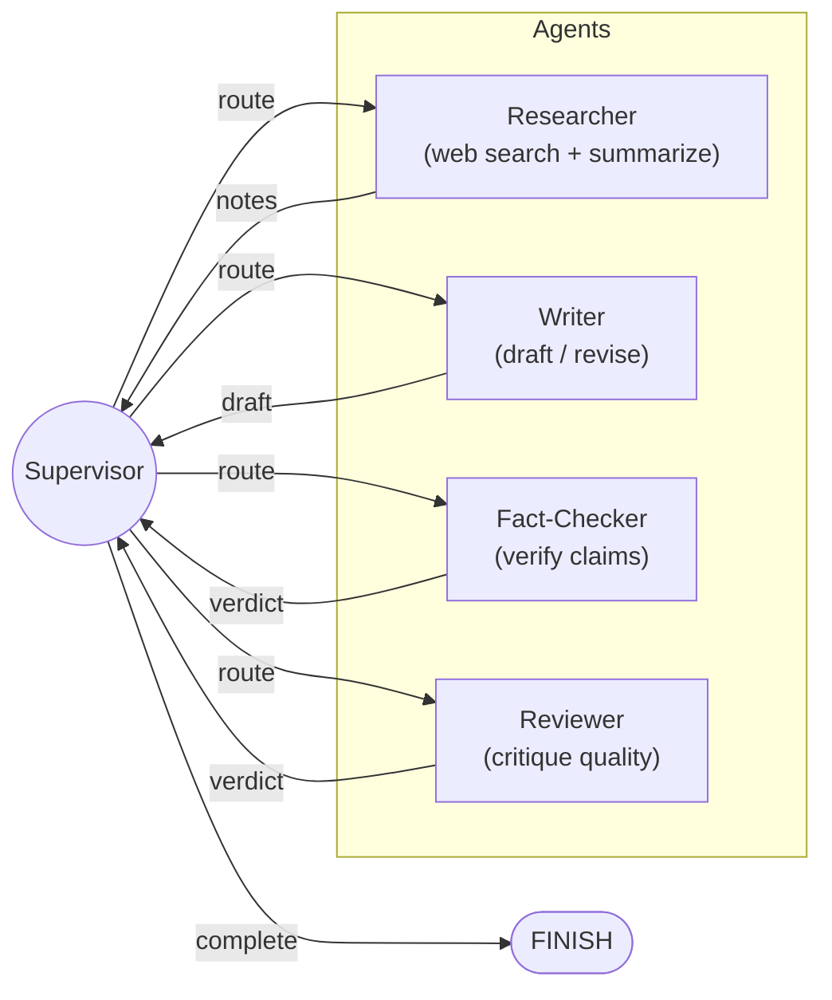

# Multi-Agent Research Assistant

[](https://github.com/hadia-sana/multi-agent-research-crew/actions/workflows/ci.yml)

A production-quality multi-agent system built with [LangGraph](https://github.com/langchain-ai/langgraph) that automates research, writing, and editorial review through coordinated AI agents.

## Architecture



### Agent Roles

| Agent | Role | Tools |
|---|---|---|
| **Supervisor** | Inspects shared state and routes work to the appropriate specialist agent. Enforces revision cap to prevent infinite loops. | None (LLM-based routing) |
| **Researcher** | Gathers information from the web relevant to the user's query and distils it into structured notes. | `web_search` (DuckDuckGo), `summarize` |
| **Writer** | Transforms research notes into a polished, well-structured report. Incorporates feedback from Fact-Checker or Reviewer on revisions. | LLM generation |
| **Fact-Checker** | Cross-checks specific factual claims in the draft against the researcher's original notes. Flags unsupported or contradicted claims. | LLM evaluation |
| **Reviewer** | Critiques the draft for writing quality, clarity, structure, and coherence. Issues an **ACCEPT** or **REVISE** verdict. | LLM evaluation |

### Key Patterns

- **Two-stage review** -- fact-checking for factual accuracy (against research notes) is distinct from writing quality review. Both feedback types loop back to the Writer, with a shared revision counter to prevent infinite loops.
- **Supervisor routing** -- a central coordinator node uses conditional edges to dispatch work, avoiding brittle hard-coded pipelines. The Supervisor enforces a MAX_REVISIONS cap across both Fact-Checker and Reviewer feedback.
- **Atomic state resets** -- when the Writer revises due to Fact-Checker flags or Reviewer feedback, the relevant state fields are atomically cleared so the next review agent performs a fresh evaluation on the updated draft.
- **Tool use** -- the researcher agent calls external tools (`web_search`, `summarize`) to gather and condense information.
- **Multi-provider LLM** -- switch between OpenAI and Anthropic with a single environment variable.
- **Iterative refinement** -- the system runs up to 3 revision cycles total across Fact-Checker and Reviewer feedback, ensuring both factual accuracy and writing quality.

## Quick Start

```bash
# Clone the repository
git clone https://github.com/<your-username>/langgraph-multi-agent.git
cd langgraph-multi-agent

# Set up environment
cp .env-template .env
# Edit .env with your API keys

# Install dependencies with uv
uv sync

# Run a research query
uv run python main.py "What are the latest breakthroughs in quantum computing?"

# Verbose mode (full agent output)
uv run python main.py --verbose "Explain the current state of nuclear fusion energy"
```

## Environment Variables

| Variable | Required | Description |
|---|---|---|
| `OPENAI_API_KEY` | Yes (if `LLM_PROVIDER=openai`) | OpenAI API key (from [OpenAI](https://platform.openai.com/api-keys) or [OpenRouter](https://openrouter.ai/keys)) |
| `ANTHROPIC_API_KEY` | Yes (if `LLM_PROVIDER=anthropic`) | Anthropic API key from [Anthropic Console](https://console.anthropic.com/account/keys) |
| `GOOGLE_API_KEY` | Yes (if `LLM_PROVIDER=gemini`) | Google Gemini API key from [Google AI Studio](https://aistudio.google.com/apikey) (free tier available) |
| `LLM_PROVIDER` | No | `openai` (default), `anthropic`, or `gemini` |

## Example Usage

```bash
$ uv run python main.py "Compare React and Svelte for building modern web apps"

============================================================
  Research query: Compare React and Svelte for building modern web apps
============================================================

--- [SUPERVISOR] ---
[Supervisor] Routing to: researcher

--- [RESEARCHER] ---
[Researcher] Gathered notes:
- React uses a virtual DOM; Svelte compiles to vanilla JS at build time
- React has a larger ecosystem and job market
- Svelte offers smaller bundle sizes and simpler syntax
...

--- [SUPERVISOR] ---
[Supervisor] Routing to: writer

--- [WRITER] ---
[Writer] Draft produced (2847 chars)

--- [SUPERVISOR] ---
[Supervisor] Routing to: reviewer

--- [REVIEWER] ---
[Reviewer] Verdict: ACCEPT
...

============================================================
  FINAL REPORT
============================================================

## React vs. Svelte: A Comparative Analysis
...
```

## Testing

This project includes a pytest test suite covering routing logic and tools.

```bash
# Run all tests
uv run pytest

# Run tests with verbose output
uv run pytest -v

# Run tests for a specific file
uv run pytest tests/test_graph.py

# Run with coverage report
uv run pytest --cov=agents
```

Tests are located in `tests/` and include:
- **test_graph.py** — Unit tests for supervisor routing logic and agent nodes
- **test_tools.py** — Unit tests for web search and summarization tools

All external calls (LLM, web search) are mocked, so tests run without requiring API keys.

## Docker

```bash
docker build -t research-assistant .
docker run --env-file .env research-assistant "Your research query here"
```

## Tech Stack

| Component | Technology |
|---|---|
| Orchestration | [LangGraph](https://github.com/langchain-ai/langgraph) |
| LLM (OpenAI) | GPT-4o via `langchain-openai` |
| LLM (Anthropic) | Claude Sonnet 4.5 via `langchain-anthropic` |
| Web Search | [DuckDuckGo](https://duckduckgo.com/) via `langchain-community` (no API key required) |
| Configuration | `python-dotenv` + `pydantic` |
| Build System | [Hatch](https://hatch.pypa.io/) |
| Package Manager | [uv](https://github.com/astral-sh/uv) |
| Containerisation | Docker (Python 3.12 slim) |

## Project Structure

```
langgraph-multi-agent/
├── agents/
│   ├── __init__.py
│   ├── config.py      # Multi-provider LLM configuration
│   ├── graph.py       # LangGraph StateGraph definition
│   └── tools.py       # Custom tools (web search, summarize)
├── main.py            # CLI entry point
├── pyproject.toml     # Project metadata and dependencies
├── Dockerfile         # Container build
├── .env-template      # Environment variable template
└── .gitignore
```

## License

MIT
